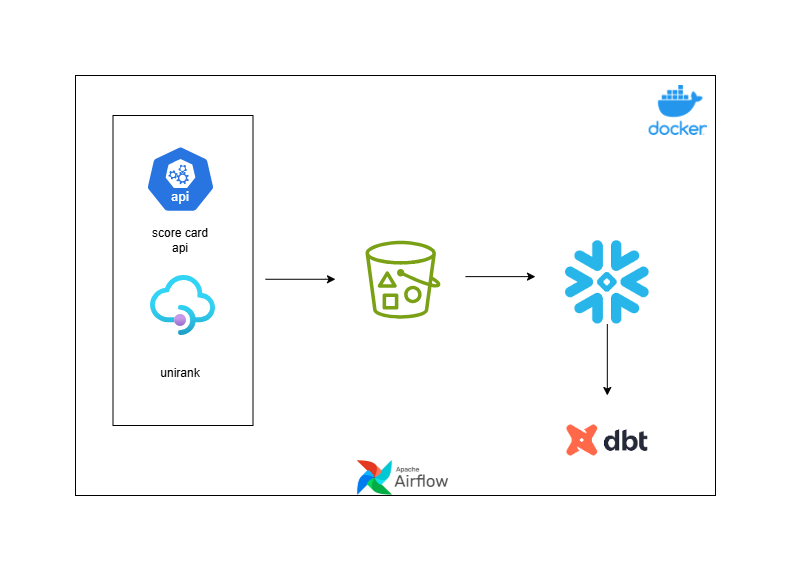

## Scalable Data Pipeline for U.S. University Information Aggregation 

### Overview 

This project provides a scalable pipeline and automated solution for aggregating information about U.S. universities, helping prospective students make informed decisions. By leveraging the USA College Scorecard API and Unirank university ranking website, the pipeline retrieves critical data points such as tuition costs, graduation rates, admission requirements, ranking and program availability for the top 1000 schools in the United States. 

The processed data is structured for analytics, enabling comparisons and insights into choice of higher education institutions at scale. 

#### Features 

- Automated Data Retrieval: Seamless integration with the USA College Scorecard API to fetch university data using API key. 
- Data Processing and Transformation: Cleaned, standardized, and enriched datasets ready for analysis. 
- Structured Data Storage and Management: Processed data stored in a Snowflake database, optimized for queries and reporting. 

- Scalability: Supports future enhancements, such as additional data sources or universities. 

- Insights-Ready: Provides actionable data to compare schools on key metrics like tuition, graduation rates, and more. 

### Project Workflow 

1. Data Extraction 

    - Connect to the USA College Scorecard API using an API key. 
    - Retrieve data for all named universities in the USA College Scorecard API.
    - Retrieve university ranking information for the top 1000 universities from Unirank website. 
    - Match the retrieved ranking information (rank, university name, location) from Unirank with the named universities in the USA College Scorecard API to get the top 1000 universities, ensuring unique matches .
    - Save the matched result to a csv file with appropriate headers for further processing. 

2. Data Transformation 
    - Load the csv file to Pandas data frame 
    - Validate the dataset to handle missing or incomplete records. 
    - Drop unnecessary columns 
    - Standardize fields such as tuition costs, school names, and degree awarded and soon. 
    - Remove duplicates and ensure consistency for analytics. 
    - Write the object to csv file 

3. Data Storage 
    - Use Amazon S3 for data storage 
    - Load the processed data into a relational database (Snowflake). 
    - Set up tables and views for quick, efficient querying and analysis. 

4. Scalability and Automation 
    - Deploy an ETL (Extract, Transform, Load) pipeline to run on a schedule using Airflow 

5. Data Accessibility and Visualization  
    - Develop data models to showcase data modelling prowess 
    - Design visuals containing key metrics about schools and enable dashboards to aid decision making ( Power BI, Dbt). 
    - Perform exploratory data analysis (EDA) to identify trends across institutions. 

### Tools 

- Python 3.10 
- Airflow  
- Snowflake  
- Dbt 
- Awswrangler
- Terraform
- Power BI 
- Docker 
